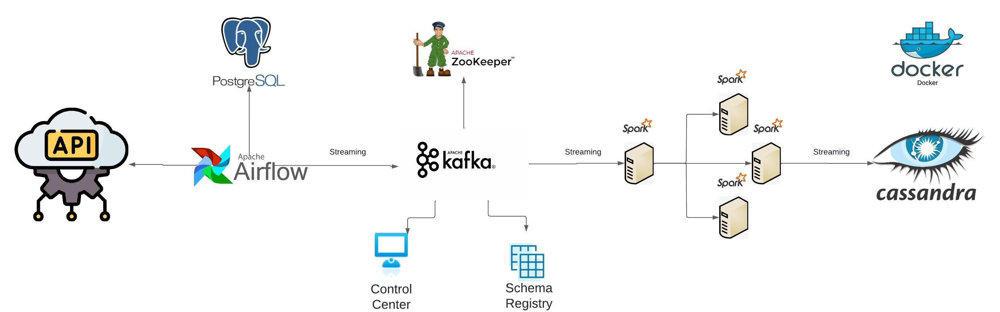

# Projeto de Streaming de Dados em Tempo Real

Este projeto é uma implementação de um pipeline de dados em tempo real usando Apache Airflow, Apache Kafka, Apache Spark e Cassandra. Ele foi desenvolvido como uma base sólida para entender e explorar o processamento de dados em tempo real.

## Visão Geral

## Funcionalidades Atuais

- **Orquestração de Workflows**: Utiliza Apache Airflow para automatizar a ingestão de dados de uma API externa.
- **Processamento de Streams**: Utiliza Apache Kafka para transmissão de dados.
- **Análise em Tempo Real**: Implementação de Apache Spark para processamento de dados.
- **Armazenamento NoSQL**: Utiliza Cassandra para armazenamento de dados.

## Tecnologias Utilizadas

- **Docker**: Para orquestração de contêineres.
- **Confluent Kafka**: Para integrações e gerenciamento de streams.
- **Apache Airflow**: Para programação e monitoramento de pipelines de dados.
- **Apache Spark**: Para processamento de dados distribuído.
- **Cassandra**: Para armazenamento de dados.

## Próximos Passos

Estou planejando expandir este projeto com as melhorias:

- **Integração com Outras APIs**: Explorar a ingestão de dados de várias fontes diferentes.
- **Criação de um Data Warehouse**: Implementar uma solução de data warehouse para análise de dados.
- **Dashboards e Visualizações**: Integrar ferramentas de visualização de dados para criação dashboards.
